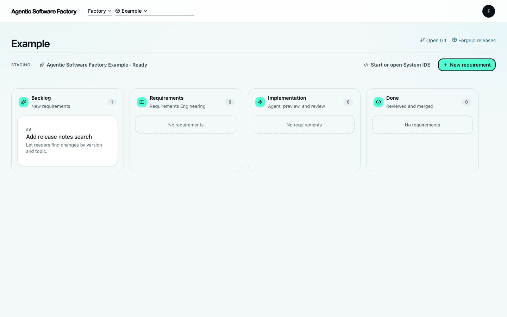
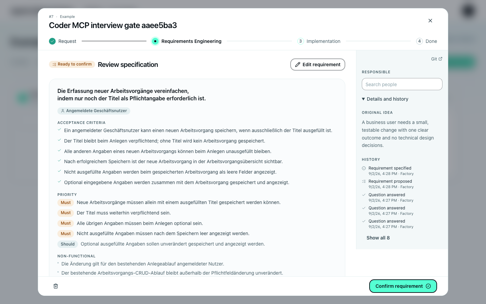
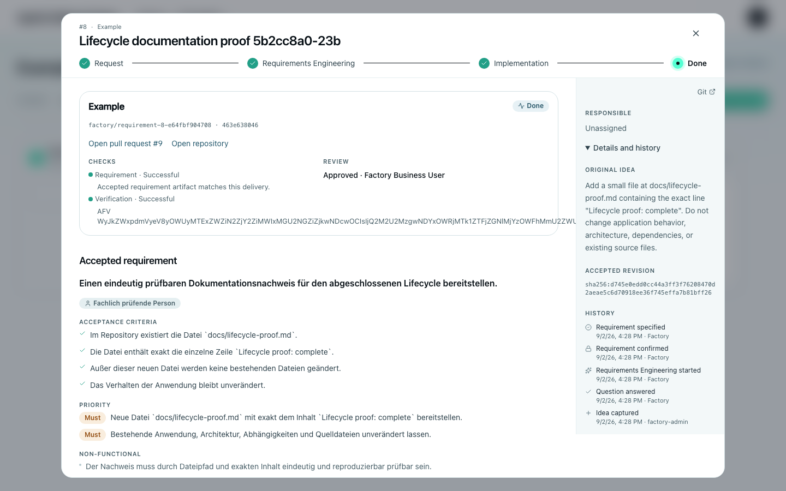
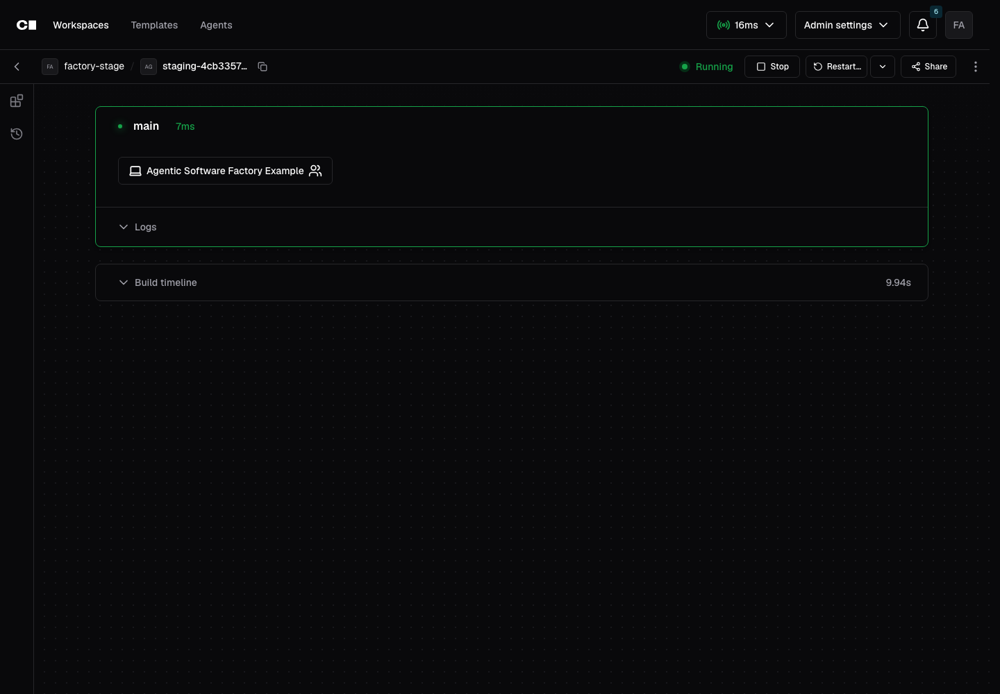

# Agentic Software Factory

[](https://github.com/maxcodefaster/agentic-software-factory/actions/workflows/check.yml)
[](LICENSE)

Agentic Software Factory takes a rough requirement to reviewed source. People
approve requirements and delivery. Agents ask questions and implement changes
inside Coder workspaces.

> [!WARNING]
> Version 0.1 is under active development, and the local stack is disposable.

## Five-minute local start

You need macOS, OrbStack with Kubernetes enabled, Git, Docker, `kubectl`, Helm,
Bun, and [mise](https://mise.jdx.dev/). Set the Kubernetes context to `orbstack`.

```bash
git clone https://github.com/maxcodefaster/agentic-software-factory.git
cd agentic-software-factory
mise install
mise run up
mise run status
```

`mise run up` uses [`example/`](example/) as its System repository, installs the
local stack, and waits for the example application to become healthy. Open:

- Factory: <http://factory.localhost>
- Coder: <http://coder.localhost>
- Forgejo: <http://forgejo-factory.localhost>

The bootstrap prints the development account details. Use `mise run deploy` for
the edit loop, `mise run check` for all checks, and `mise run down` to stop
without deleting data. `mise run reset --data` is the guarded destructive reset.

## Visual tour

Start with an idea on the System board. The board reads Forgejo issues rather
than keeping a second issue store.



When a configured Coder Agent model is available, the interview turns the idea
into a proposal that a person must accept.



Factory then prepares the handoff. Forgejo keeps the branch, pull request,
review, verification result, and merge evidence.



The developer works in a stock Coder workspace built from the System
repository's Dev Container.



## The boundary

Factory coordinates identity, human gates, and handoffs. Forgejo remains
authoritative for work and source. Coder remains authoritative for agents,
workspaces, IDEs, and application URLs. Factory never writes to either
product's database.

The local deployment is for development. Production operators own DNS, TLS,
capacity, secrets, rate limits, dependencies, backups, upgrades, and incidents.
Factory does not deploy a System's application to production. Architectural
reasons live in the [ADRs](docs/adr/).

## Bring a System

A System is a Git repository with `.factory/system.yaml` at the selected commit.
The file names its development and verification Dev Containers, runtime supervisor,
startup timeout, browser applications, and health checks.

```yaml
version: 1
development:
  devcontainer: .devcontainer/devcontainer.json
verification:
  devcontainer: .devcontainer/verification/devcontainer.json
runtime:
  supervisor:
    kind: custom
    commands:
      status: ./dev status
      shutdown: ./dev stop
  startupTimeoutSeconds: 120
applications:
  - slug: web
    displayName: Web
    url: http://127.0.0.1:3000
    verification: required
    health:
      url: http://127.0.0.1:3000/health
      intervalSeconds: 5
      failureThreshold: 12
```

Use the maintained [`example/`](example/) for a complete process-compose setup.
Bring another clean local repository with:

```bash
mise run up -- /absolute/path/to/system
```

## Authentication modes

| Mode | Configuration |
| --- | --- |
| `local` | Set `AUTH_MODE=local`, `LOCAL_AUTH_EMAIL`, and `LOCAL_AUTH_PASSWORD`. The local stack does this automatically. |
| `entra` | Set `AUTH_MODE=entra`. Register one tenant-specific Entra OIDC application and assign Factory App Roles. |

Better Auth remains the downstream OIDC issuer for both products. See the
[production guide](deploy/production/README.md) for Entra setup and secrets.

## Azure and AKS

For Azure, provision AKS, DNS and TLS, PostgreSQL 16 or newer with recovery,
ingress-nginx, required operators, encrypted snapshots, Coder, and Forgejo.
Create an overlay for [`deploy/production/`](deploy/production/), keep secrets
outside Git, then run its validation and upgrade scripts. Test login and restore
before opening access.

## Project links

- [Architecture decisions](docs/adr/)
- [Contributing and governance](CONTRIBUTING.md)
- [Code of Conduct](CODE_OF_CONDUCT.md)
- [Security policy](SECURITY.md)
- [Production deployment](deploy/production/README.md)
- [Changelog](CHANGELOG.md)
- [RPL-1.5 license](LICENSE) and [notice](NOTICE)

Questions use the support issue form. Support is best effort. Never post secrets,
personal data, proprietary source, or vulnerabilities. Use [SECURITY.md](SECURITY.md)
for private vulnerability reports.
